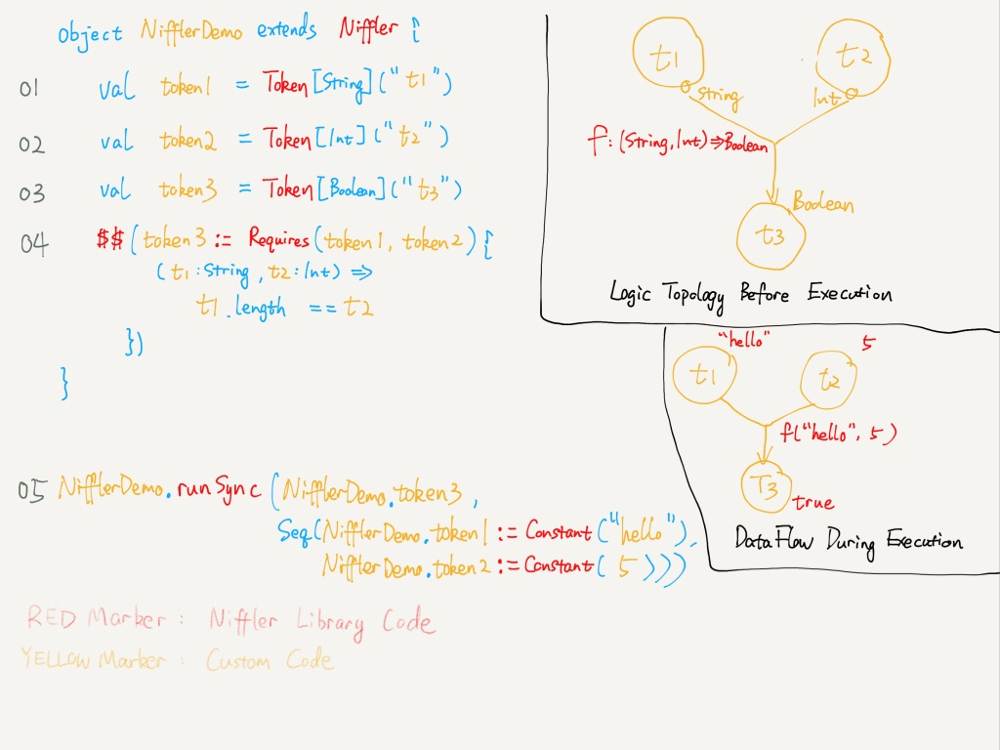
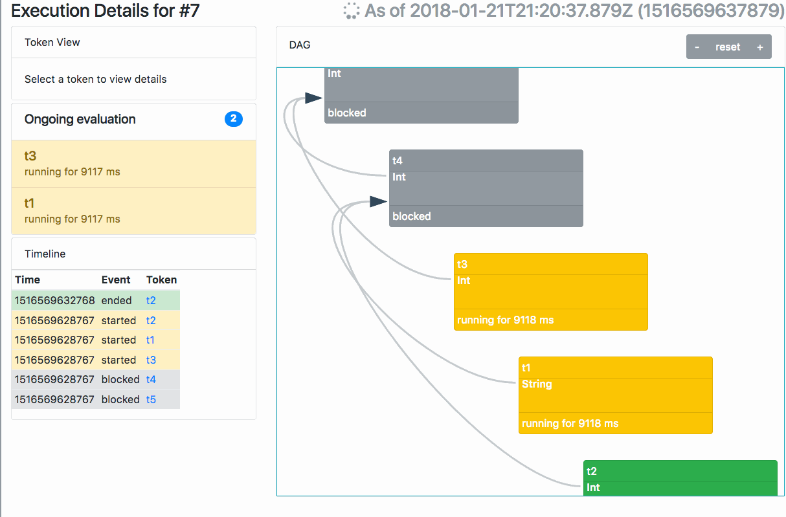
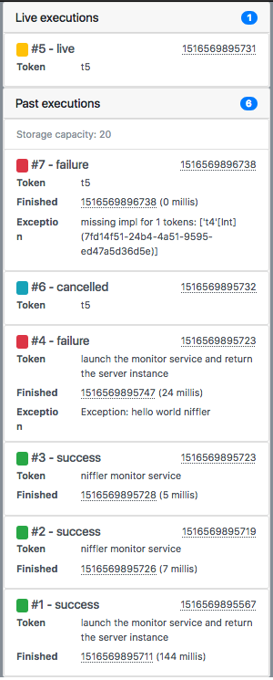
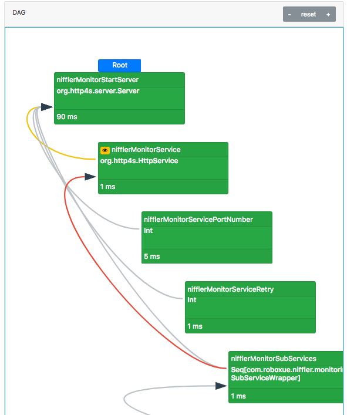

Niffler: Dataflow programming for Scala
----
[](https://travis-ci.org/roboxue/niffler)

<strong>Self optimize, Self document, Self monitor</strong>

## Install
published to Maven Central and cross-built for Scala 2.11 and 2.12, so you can just add the following to your build.sbt

[](https://maven-badges.herokuapp.com/maven-central/com.roboxue/niffler-core_2.11)  
[](https://maven-badges.herokuapp.com/maven-central/com.roboxue/niffler-core_2.12)  
```sbt
val nifflerVersion = "x.x.x" // for latest version see the badges above

libraryDependencies ++= Seq(
  "com.roboxue" %% "niffler-core",
  "com.roboxue" %% "niffler-monitoring" // optional
).map(_ % nifflerVersion)

```

**Niffler** is a [Dataflow programming](https://en.wikipedia.org/wiki/Dataflow_programming) library for Scala. 
It's a set of lightweight DSL that encourages developer to write application logic in [Pure functions](https://en.wikipedia.org/wiki/Pure_function) 
and assembly these logic fragments into executable [DAGs](https://en.wikipedia.org/wiki/Directed_acyclic_graph) in runtime.

- `Token[T]` + `Formula[T]` = `DataflowOperation[T]`
- `Niffler` = `Logic` = `Map[Token[Any], Formula[Any]]` = `Seq[DataflowOperation[Any]]`
- Invoke `Token[T]` within `Logic` using an `ExecutionCache`, this returns an `AsyncExecution[T]`
- `AsyncExecution[T]` is a promise of `ExecutionResult[T]`
- `ExecutionResult[T]` contains `result: T`

**Code => Logic**


**Logic => Execution**


## Why use Niffler / Dataflow Programming
By using Niffler, you can easily utilize what data flow programming provides, plus additional operation benefits --

#### Self Optimize
Thanks to the nature of Data flow programming, your program can execute itself in the best possible way. Excerpts from [wikipedia](https://en.wikipedia.org/wiki/Dataflow_programming) are pretty good summary already:
- Parallelism
> A dataflow program is more like a series of workers on an assembly line, each doing a specific task whenever materials are available ...   
  Dataflow languages are inherently parallel and can work well in large, decentralized systems
- Less custom state management
> Since the operations are only concerned with the availability of data inputs, they have no hidden state to track, and are all "ready" at the same time

#### Self Documentation
More than the programming paradigm, Niffler has great operation utilities!
- Visualize your code base as a DAG: because of the nature of Data flow programming, it's straight forward to visualize your codebase
> A traditional program is usually represented as a series of text instructions  
  (However) the flow of data is explicit, often visually illustrated as a line or pipe.
- Opportunity to dump svg files at compile time. 
  Your architecture graph will less likely out of sync with an SBT step dumping `Niffler` into .svg files
- Documentation are bind to `Token`, saving a lot of repeated doc strings when `Token` are frequently reused

#### Self Monitor
Application monitoring and benchmarking becomes extremely easy using Niffler. You can
- View the progress (animated!) of ongoing executions when your app is alive via a web UI
- Telemetry data generated automatically, so you can cut a huge part of your logging code 
- Because we can pin point where an exception was triggered, debugging becomes way easier 

## Niffler Terminology

##### Writing code
* `Logic` is the core part of Niffler, implemented as a HashMap, where the key is a `Token` and value is a `Formula`
* `Token[T]` is the description and metadata of a data, similar to "A variable declaration with documentation string"
* `Formula[T]` is a wrapper of function `(D1, D2, D3.., Dn) => T`, plus a sequence of `Token` as prerequisites,  
  and they have to be of type `Token[D1], Token[D2], Token[D3], ..., Token[Dn]`.
  To create a `Formula`
  - use one of the helper functions among `Requires.apply(...)` to declare dependency on multiple tokens 
  - `Constant.apply(...)` to declare zero dependency and yield a constant in runtime
  - `Token.asFormula(...)` to declare dependency on a single `Token` and perform an optional transform on it 
* `DataFlowOperation` is a pair of `Token` and `Formula`. Thus `Logic` can also be viewed as a collection of `DataFlowOperation`. Treat `DataFlowOperation` as "sentences" in other language as the base unit that will be evaluated in runtime

##### Running code
* `ExecutionCache` is a HashMap, where the key is a `Token[SomeType]` and value being `data: SomeType`
* `Logic` can be asked to evaluate `Token` in an `ExecutionCache` sequentially (single thread illusion provided by underlying akka implementation)
* On evaluating a `Token`, the runtime will first check if `ExecutionCache` contains this token or not.  
  If hit, the cache result will be returned  
  Else when miss, runtime will lookup `Logic` for this `Token`'s `Formula`,
  then trigger the execution of this `Formula`'s prerequisite tokens in parallel and recursively.
  The `Formula`'s underlying function will be executed whenever its prerequisites has been met.
  The result will be written back to `ExecutionCache` using the token it binds to as the key
* `Execution` can be triggered either synchronously or asynchronously.  
  Sync trigger will return an `ExecutionResult[T]`;  
  Async trigger will return an `AsyncExecution[T]`, basically a wrapper around `Promise[ExecutionResult[T]]` 

##### Organizing code
* `Niffler` is a trait that has a private collection of `DataFlowOperation`, with helper functions to add new `DataFlowOperation` into this collection 
* `Nifller`, being a collection of `DataFlowOperation`, can be converted directly into a `Logic`. You can also combine a few Nifflers to make a unioned `Logic`

##### Launching monitor UI
- Make sure `niffler-monitor` package has been included in your project
- Add the following line to your codebase
```scala
Niffler.combine(NifflerMonitor, ExecutionHistoryService).asyncRun(NifflerMonitor.nifflerMonitorStartServer)
```
- Open localhost:4080

##### Tutorial
see [NifflerSyntaxDemo.scala](example/src/main/scala/com/roboxue/niffler/examples/NifflerSyntaxDemo.scala)

### Niffler aims for...
##### Better performance on complex logic
- Concurrent execution, fully automated: Your application/`Niffler` is basically a collection of `DataFlowOperation`s, which will automatically form a [DAG](https://en.wikipedia.org/wiki/Directed_acyclic_graph). This means Niffler will concurrently trigger the evaluation of `DataFlowOperation` whenever its dependency has been met. The following [example1](#example-1) demos the very basic idea of it.
  > There will be a huge gain if your code is previously single threaded executed, or if executed remotely via RPC calls, like Spark operation. This gain might be trival or even negative however, because of the DAG setup overhead, if your logic is very simple or the execution relis heavily on local CPU resources. But there are still many other reasons that Niffler might be useful in these situations

- Better scheduling: instead of launching jobs with commandline arguments, and scheduling using a crontab, Niffler allows you to start a server, and trigger different main functions in your jar on demand via REST endpoints or UI.
  > This might be trival again if your application is simple. But if your repo is a collection of complex datapipelines, and/or they are currently sharing status like failed/succeeded using file system, give Niffler a try. Niffler eliminates the need of a standalone scheduling system, and provides the state sharing utilities from `ExecutionCache`

##### Better monitoring
- Out-of-box web UI will display every Niffler DAG's execution status, allowing you to visually inspect which part of your logic is throwing exceptions and how your DAG is executed in parallel.
- Automatic performance metrics: Remeber the times you need to do timings like `println("this operation took ${endTime - startTime} millis")`? Since there is a clear logic boundry among `DataFlowOperation`, this is done automatically by Niffler now.
-  [screenshots](#example-3)

##### Better maintenance
- Maximize code reuse and testability: Break application logic down into `DataFlowOperation`([Pure functions](https://en.wikipedia.org/wiki/Pure_function)), so that every line of code in this function is reusable and testable
- DRY up your comments: don't repeat yourself even when commenting. Doc string belongs to `Tokens`. The moment your `DataFlowOperation` referenced other `Token`s, their doc-string follows as well. See [example2](#example-2)

##### Better teamwork
- Reduce pull request diff size: With Niffler, it is totally possible to get rid of abstract method declaration in interfaces and class constructors, the major reason why there is merge conflicts during teamwork. 
- Self graphic doc: Tired of drawing a flowchart to demonstate your dataflow which will be out-of-date the moment it has been created? Automated DAG means self-graphic-doc


#### Example 1
Concurrent execution
```scala
    import com.roboxue.niffler.{Logic, Token}
    import com.roboxue.niffler.syntax.Constant
    // these lines help self-doc
    val tA = Token[Int]("this will print 'A' and return 1")
    val tB = Token[Int]("this will print 'B' and return 2")
    val tC = Token[Int]("this will print 'C 1+2' and return 3")
    // these lines assemble the logics
    val logic = Logic(Seq(
      tA := Constant({ Thread.sleep(1); print("A"); 1 }),
      tB := Constant({ Thread.sleep(1); print("B"); 2 }),
      tC := Requires(tA, tB) {
        (resultOfA: Int, resultOfB: Int) =>
          println(s"C: $resultOfA + $resultOfB")
          resultOfA + resultOfB
      }
    ))
    // these lines trigger the execution
    // you'll see 'ABC 1+2' on screen or 'BAC 1+2' randomly
    for (_ <- Range(0, 100)) {
      assert(logic.syncRun(tC).result == 3)
    }
```

##### Example 2
Saving doc strings

Niffler doesn't try to replace well designed scaladoc. By outputing DAG graph automatically, it aims to improve the documentation quality by reducing the "degree of freedom" for the docs.
In the example below, because every `Token` being refereneced when writing niffler `DataFlowOperation` has been documented upon creation, we 'DRY'ed up two redudant doc strings.

Before:
```scala
    /**
      * @param p1 p1Description
      * @param p2 p2Description
      * @return myWorkDescription
      */
	def myWork(p1: String, p2: Int): Boolean

    /**
      * @param p1 p1Description
      * @param p2 p2Description
      * @return myOtherWorkDescription
      */
	def myOtherWork(p1: String, p2: Int): Char

    // we are writing 6 lines of docstring now
    // note that p1Description and p2Description has appeared twice, and potentially many more times elsewhere
    // and these docstrings can only be string literal, it cannot be programmatically generated
    // let's fix this in Niffler
```
After:
```scala
    // doc string binds to Token
	val p1 = Token[String]("p1Description")
	val p2 = Token[Int]("p2Description")
    // doc string can be programmatically generated!
    val myWork = Token[Boolean](s"myWorkDescription uses ${p1.name}")
    val myOtherWork = Token[Boolean]("myOtherWorkDescription")
    // only 4 lines of doc strings, and that is really the minimum you can get

    // doc free implementation, add comments only when needed
    myWork := Requires(p1, p2) {...}
    myOtheWwork := Requires(p1, p2) {...}
```

##### Example 3
View all Niffler `Executions` on your jvm in supporting web-ui


Pin point where is the exception when debugging your app


View Niffler `Logic` as DAG with automated telemetry


##### Housekeeping
To release, make sure pgp key and sonatype credential is in the correct location, then execute 
- `sbt "release cross with-defaults"` for minor version updates
- `sbt release cross` for major version updates

### What is Niffler?
**Niffler** is a made-up "Magic creature" in Harry Porter series. It was featured in the recent movie *Fantastic Beasts and Where to Find Them*. It's essentially a "wallet" that knows how to fill itself up... I'm naming after this library based on Niffler's nature as a container of Token, and a symbol of "greedy" for a better developer experience (we know greedy is no a bad word in computer science)

> "Nifflers had a pouch on their bellies which held far more than at first seemed possible, like the effects of an Undetectable Extension Charm on a container."


> "It's time to be greedy"  


> ^^ A `niffler` whose collection of `DataFlowOperation`s is being dumped into a `Logic`

